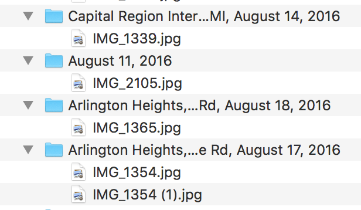

# Flatten Directories

## The challenge

iPhoto directory structure:


I would like to have NO SUBFOLDERS and inside my higher level folder:

160814_Capitol Regional International… MI_1339.jpg
160811_2105.jpg
160818_Arlington Heights,… Rd_1365.jpg
etc…


## A Solution

## Setup
1. Open Terminal (command-space then type "terminal" -- should popup before you need to type the whole word, then you can just click on it)
2. type this into the terminal window
   `git clone https://github.com/ultrasaurus/flatten-directories.git`
3. then you can see that there is a new directory (`ls`), you should see `flatten-directories`
4. to run the script against the testdata:
   ```
   cd flatten-directories/testdata
   ../flatten.sh
   ```

## Using this script
1. make a copy of all the files (duplicate root folder and put it somewhere you remember -- clearly labelled something like: whatever-BACKUP
2. copy files into this directory
3. Type cd (don't press return)
4. Find your folder with the photos, then drag the icon at the top to the Terminal window
5. press return
6. ls <return> -- you should see the sub-folders
7. mkdir new <return>  -- make a folder named "new" which is where we will put your files
8.  now run the script
    ```
     ../flatten.sh
    ```
    then press return
